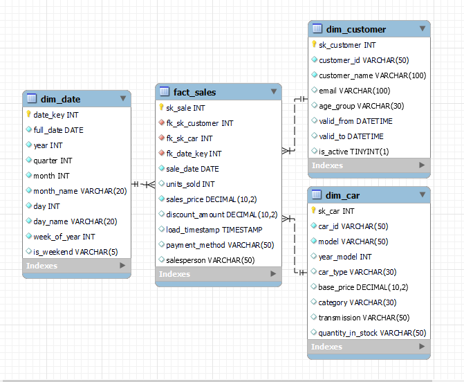

# Car Sales Analytics Dashboard | 10,000 Transactions (Oct 2022 – Oct 2025)

**End-to-End Automotive Retail Intelligence Project**  
500 unique car models • MySQL Star Schema • Interactive Power BI Dashboard  
From raw Kaggle data → Normalized data warehouse → Executive-ready insights & recommendations

** Please review the project report to view the analysis

## 🚀 Project Overview & Business Impact
Comprehensive analysis of **10,000+ car sales transactions** across 3+ years, delivering actionable insights on:
- Revenue growth & seasonality
- Shifting customer preferences (age groups, payment methods, fuel types)
- Inventory health & stockout risks
- Pricing power vs discount dependency by model
- Top-performing models & customer concentration

Helps dealerships optimize inventory, pricing strategy, financing offers, and marketing focus.

## 🎯 Key Business Insights
| Area                       | Highlight                                                                                  | Recommendation                                      |
|----------------------------|--------------------------------------------------------------------------------------------|-----------------------------------------------------|
| Revenue Trend              | Strongest growth in FY2023–2024; mid-year peaks (Apr–Jul), slowdown Aug–Sep                | Plan promotions for slower months                   |
| Customer Demographics      | Seniors = 40–42% of buyers; Mid-age growing fastest                                       | Tailor financing & loyalty programs by age group   |
| Payment Methods            | Installments surged to 34% by 2025; Cash declining                                         | Expand installment partnerships                     |
| Fuel Type Shift            | Electric vehicles rose to 26% (nearly matching Petrol)                                     | Accelerate EV inventory & charging incentives       |
| Top Models (Units)         | Cerato #1, followed by 5 Series, Sunny, Tucson                                             | Ensure continuous stock for Cerato & 5 Series       |
| Top Models (Revenue)       | Cerato, 5 Series, Sunny dominate                                                          | Focus premium marketing on these models             |
| Customer Concentration    | Top 10 customers <15% of total revenue → healthy diversification                          | Low concentration risk                              |
| Margin Classes             | Premium pricing (30%+ above base) consistently highest volume                             | Protect pricing power on Sunny, Camry, Model X      |
| Inventory Alerts (Jul 2025)| Tucson & Sunny critical; 5 Series has 7 units out-of-stock                                 | Immediate restocking + dynamic safety stock         |

## 🛠️ Tools & Technologies
- **MySQL** – Full data warehousing, normalization, surrogate keys, CTEs, window functions
- **Power BI** – Interactive executive dashboard (drill-down by year/month/model/customer/fuel type)
- **DAX** – Advanced measures (Z-score segmentation, running totals, YoY growth)

## 🗃️ Data Modeling – Clean Star Schema
Transformed 3 raw tables into a scalable star schema:

### Dimension Tables
- `dim_customer` (with age groups & segmentation)
- `dim_car` (model, brand, fuel type, body style, margin class, price class)
- `dim_date` (full fiscal calendar + weekend/holiday flags)

### Fact Table
- `fact_sales` (10,000 granular transactions)

→ Full **ERD** included

  

## 📊 Power BI Dashboard Features
Interactive pages covering:
- Executive Summary (Revenue, Units, AOV trends)
- Model Performance (Top 10 by units/revenue, margin analysis)
- Customer Insights (Age groups, top buyers, payment methods)
- Fuel Type Evolution (2022–2025)
- Inventory Health & Stock Alerts (July 2025 snapshot)
- Pricing Strategy (Premium vs Discount distribution)
- Z-Score Segmentation & Outlier Detection

*.pbix file included in repository*

## 📁 Repository Structure
├── data/                  # Raw & cleaned datasets (respect Kaggle license)
├── sql/
│   ├── 01_data_profiling.sql
│   ├── 02_create_star_schema.sql
│   ├── 03_feature_engineering.sql
│   └── ERD_Star_Schema.png
├── powerbi/
│   └── Car_Sales_Dashboard.pbix
├── images/                # Dashboard screenshots + ERD
└── README.md

## 🎯 Why This Project Stands Out
- Real automotive retail dataset with 3+ years of trends
- Proper data warehouse design (star schema + surrogate keys)
- Heavy SQL + advanced Power BI (Z-scores, dynamic segmentation, inventory alerts)
- Clear business recommendations backed by data
- Ready-to-present to dealership owners or auto retail hiring managers

Perfect for Data Analyst, Business Intelligence Analyst, or Automotive Analytics roles.

⭐ Star if you found this useful!  
Always open to feedback and improvements.

🔗 LinkedIn: [linkedin.com/in/abu-sufian-data] | More projects: [will come soon]

